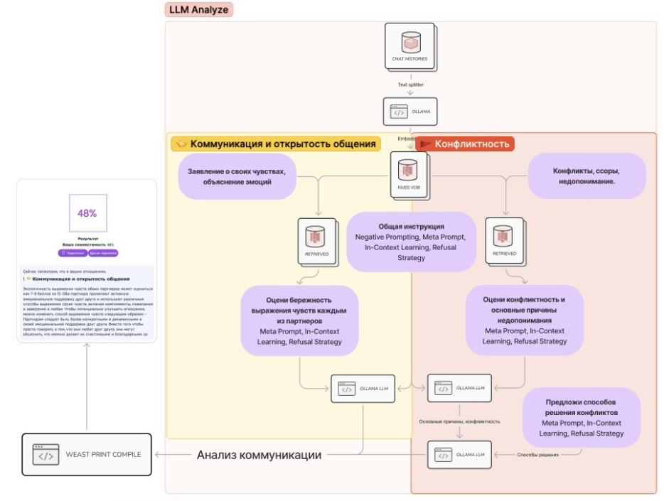
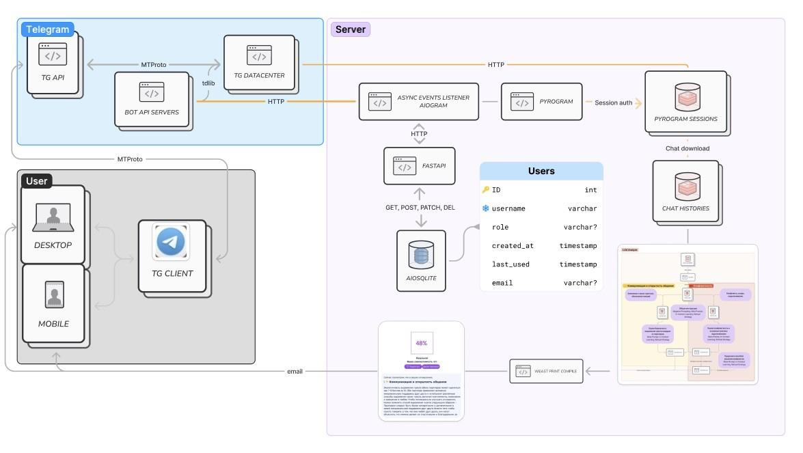

# Дизайн документа ML-системы - TwoHearts_AI MVP 1.0

*Основано на шаблоне ML System Design Doc от телеграм-канала [Reliable ML](https://t.me/reliable_ml)*

---

## 1. Цели и предпосылки

### 1.1 Цели разработки продукта

- **Бизнес-цель:**

    - Создать мобильное приложение **TwoHearts_AI** для улучшения психоэмоционального состояния пользователей посредством анализа их переписки с использованием больших языковых моделей (LLM) и методов обработки естественного языка (NLP).
    - Достичь 5000 ежемесячных активных пользователей к концу декабря 2024 года.
    - Получить грантовую поддержку и финансирование для дальнейшего развития.

- **Преимущества использования ML:**

    - Автоматический анализ длинных переписок с помощью LLM и NLP позволит выявлять паттерны коммуникации и предоставлять персонализированные рекомендации.
    - Сделает психологическую помощь более доступной и оперативной, снизив стоимость услуг по сравнению с традиционными методами.
    - Пользователи смогут улучшить свои отношения без необходимости обращения к специалистам.

- **Критерии успеха с точки зрения бизнеса:**

    - Разработка MVP приложения с функционалом анализа переписки и генерации отчёта.
    - Получение положительной обратной связи от не менее 70% пользователей бета-тестирования.
    - Привлечение первых платных пользователей и достижение ключевых показателей вовлечённости.

### 1.2 Бизнес-требования и ограничения

- **Бизнес-требования:**

    - **Функциональные:**
        - Реализовать приложение, позволяющее пользователям загружать переписку из Telegram.
        - Автоматически создавать визуальный отчёт с результатами анализа чата.
        - Предоставлять персонализированные рекомендации по улучшению отношений.
        - Обеспечить безопасность и конфиденциальность данных пользователей.

    - **Нефункциональные:**
        - Обеспечить высокую производительность и надёжность системы.
        - Создать удобный и интуитивно понятный пользовательский интерфейс.
        - Соответствовать законодательству по обработке персональных данных.

- **Бизнес-ограничения:**

    - Ограниченный бюджет на разработку и инфраструктуру.
    - Поддержка только русского языка на этапе пилотного запуска.
    - Локальная обработка данных без подключения сторонних сервисов.
    - Ограничения в технической экспертизе команды.

### 1.3 Область охвата проекта

- **Входит в скоуп:**

    - Разработка Telegram-бота для взаимодействия с пользователями.
    - Реализация функционала выгрузки и обработки переписки из Telegram.
    - Настройка RAG-пайплайна и интеграция с локальной LLM.
    - Генерация визуального отчёта с анализом коммуникации и конфликтности партнёров.
    - Обеспечение безопасности данных и соответствие законодательству.

- **Не входит в скоуп:**

    - Поддержка выгрузки переписки из WhatsApp и других мессенджеров.
    - Анализ медиафайлов и мультимодальных данных.
    - Реализация анализа по типологиям личности Майерс-Бриггс (MBTI).
    - Тонкая настройка модели на пользовательских данных.
    - Поддержка других языков на этапе пилотного запуска.

### 1.4 Предпосылки и обоснование решения

- **Использование локальных LLM:**

    - Для обеспечения конфиденциальности данных и соответствия законодательству обработка происходит на собственных серверах без передачи данных третьим лицам.
    - Используются модели с открытым исходным кодом, дообученные на русском языке.

- **Применение RAG (Retrieval Augmented Generation):**

    - Техника RAG помогает преодолеть ограничения окна контекста LLM.
    - Позволяет извлекать релевантные фрагменты из длинных переписок для анализа.

- **Фокус на русском языке:**

    - Основная целевая аудитория — русскоговорящие пользователи.
    - Модель и инструменты должны эффективно работать с особенностями русского языка.

- **Безопасность и конфиденциальность:**

    - Строгое соблюдение законодательства по обработке персональных данных (GDPR, ФЗ-152).
    - Шифрование данных при хранении и передаче.
    - Данные переписки не сохраняются после обработки.

---

## 2. Методология

### 2.1 Постановка задачи

- **Тип задачи:**

    - Анализ текста с использованием NLP для выявления паттернов коммуникации.
    - Генерация персонализированных рекомендаций по улучшению отношений.

- **Техническая цель:**

    - Разработать систему автоматизированного анализа текстовой переписки пользователей с использованием LLM и RAG для предоставления рекомендаций по улучшению коммуникации и отношений между партнёрами.

### 2.2 Схема решения

1. **Пользовательский интерфейс (Telegram-бот):**

     - Регистрация и авторизация пользователя.
     - Предоставление инструкций по выгрузке переписки.
     - Получение согласия на обработку данных.

2. **Выгрузка и предобработка переписки:**

     - Получение переписки через Telegram API с согласия пользователя.
     - Очистка данных, токенизация, нормализация текста.

3. **Индексация и создание эмбеддингов:**

     - Разбивка переписки на логические фрагменты.
     - Создание эмбеддингов с помощью модели Sentence Transformers.
     - Индексация эмбеддингов в векторной базе данных (FAISS).

4. **Извлечение релевантного контекста (RAG):**

     - Поиск релевантных фрагментов на основе заданных тем (коммуникация, конфликтность).
     - Использование косинусного расстояния для оценки схожести эмбеддингов.

5. **Анализ с помощью LLM:**

     - Промпт-инжиниринг для улучшения качества генерации.
     - Использование локальной LLM для анализа контекста.
     - Получение оценок и рекомендаций.

6. **Формирование отчёта:**

     - Структурирование выводов и рекомендаций.
     - Визуализация данных (графики, диаграммы).
     - Генерация отчёта в формате PDF с использованием WeasyPrint.

7. **Доставка отчёта пользователю:**

     - Отправка отчёта через бота или на электронную почту.
     - Обеспечение безопасности передачи данных.

### 2.3 Этапы решения задачи

Ниже описаны **этапы** разработки решения, опираясь на результаты **EDA** и требования бизнес-логики TwoHearts_AI. Для каждого этапа мы приводим детали **отдельно для бейзлайна** (простое решение) и **MVP** (полноценная реализация с локальной LLM и RAG).

#### Этап 1. Подготовка данных

Этот этап формирует основу для последующих модулей — очистку, анонимизацию, структурирование и чанкинг переписок.

##### 1.1 Данные и сущности

- **Исходная сущность**: Переписки (чаты) пользователей, выгружаемые из Telegram в формате:
   - Формат: `JSON` - при экспорте самим пользователем из клиента Телеграм, `.txt` - при выгрузке через созданную сессию Pyrogram в разработанном телеграм-боте, реже `HTML` (выгрузка из Telegram).  
   - Объём: в среднем 20–30 тыс. сообщений в чате, возможны чаты до ~40k+ сообщений.  
   - Ограничение размера: ~1000 МБ на загружаемый файл.  
   - Содержат поля: ID сообщения, текст, дата, автор, реакции, медиа и голосовые сообщения(иногда), метки овтетов и пересылаемых сообщений.  

- **Состав признаков для машинного обучения**:
  - Дата/время (date), автор сообщения (author), текст (text), реакции (reactions), 
    *возможная* сервис-информация (reply_to, media_type).
  - Дополнительные фичи (MVP): токенизация, эмбеддинги, тональность, временные интервалы.

- **Целевые переменные** (при необходимости разметки):
  - Для бейзлайна: «конфликтность» отдельных сообщений (или мини-диалогов), размеченная эвристически. 
  - Для MVP: пользовательские рейтинги (NPS), собранные после генерации рекомендаций.

Ниже пример таблицы, описывающей источники данных и их проверку качества:

| Название данных                   | Есть ли данные в компании (источник)      | Требуемый ресурс для получения данных    | Проверено ли качество данных |
|----------------------------------|-------------------------------------------|------------------------------------------|--------------------------------|
| Telegram-чаты (JSON / HTML / txt)| Пользователь вручную / бот Telegram       | DS/DE + Backend-инж.                    | Частично (EDA)                 |
| Доп. разметка «конфликтность»    | Ручная/эвристическая (внутренняя)         | DS, при поддержке психологов (опцион.)   | Частично                       |
| Эмбеддинги и метаданные (MVP)    | Генерируются в пайплайне RAG             | DS                                      | Проверка EDA                   |
| Оценки NPS от пользователей      | Храним в аналитической БД проекта         | DS/backend                               | Частично                       |

##### 1.2 Описание процесса генерации/получения данных

1. **Загрузка чата**:
   - Пользователь отправляет файл (JSON / HTML / txt) через бота или веб-интерфейс.
   - Если объём >1000 МБ или формат «битый», включаем fallback-процедуры (просим переформатировать или ограничить период).
2. **Очистка и парсинг**:
   - Вытаскиваем ключи `date`, `text`, `author`. Если их нет (битый файл) — переходим к упрощённому анализу только текста.  
   - Убираем спам-сообщения, служебные отметки.
3. **Анонимизация**:
   - Применяем **NER-модуль**, чтобы скрыть PII (ФИО, телефоны, адреса).  
   - Исходный файл не храним дольше, чем нужно для обработки.
4. **Чанкинг**:
   - На основе временных интервалов (медианное время ответа ~800 секунд) разбиваем на мини-диалоги — важный шаг для RAG (MVP) и для бейзлайна (можно примитивно агрегировать).
5. **Проверка качества**:
   - Если <50 сообщений, идем сразу в инференс модели - все войдет в контекст.
   - EDA показала, что кейсы с неполным форматом (например, нет автора у 30% сообщений) будут встречаться, так что переходим в fallback.
#### 1.3 Результаты этапа

- **Бейслайн**:
  1. Упрощённая витрина (только очищенный текст, базовые поля `date` и `author`, если есть).
  2. Возможность применять словарь грубой лексики на чанках.
- **MVP**:
  1. Полный набор: эмбеддинги, чанки, временные интервалы, сохранённые (и анонимизированные) данные для RAG.
  2. Возможность хранить часть анонимизированных выборок (не более 2 недель) для дальнейшего дообучения локальной LLM.

#### 1.4 Риски и их учёт

- **Повреждённые файлы**: писать «робастные» fallback-парсеры, уведомление пользователю.
- **Конфиденциальность**: анонимизация (NER), удаление исходных файлов сразу по завершении.
- **Недостаток данных**: <50 сообщений — выводим только шаблонные рекомендации (или предупреждаем о неточности).
- **Правовые аспекты**: храним анонимизированные фрагменты не более 2 недель.
---

#### Этап 2: Индексация и извлечение контекста (RAG)

На этом этапе мы переводим переписку (или её чанки) в векторное пространство, чтобы эффективно искать релевантные фрагменты при анализе.
- **Действия:**
    - Разбивка текста на фрагменты и создание эмбеддингов.
    - Индексация в векторной базе данных для быстрого поиска.
    - Извлечение релевантных фрагментов по заданным темам.

##### 2.1 Формирование выборки и обработка (бейслайн vs. MVP)

- **Бейслайн**:
  1. **Выборка**: берём ~200 анонимизированных диалогов (100 конфликтных / 100 нет), размечаем наличие грубой лексики.
  2. **Подготовка**: простая токенизация (без эмбеддингов). По сути, RAG здесь не используется, но можем делать разбиение на фрагменты для подсчёта «частоты грубостей».
  3. **Валидация**: hold-out (80/20), метрика — F1 по выявлению конфликтных мест.

- **MVP**:
  1. **Выборка**: собираем реальные выгрузки пользователей (с согласием на анонимизированное хранение) → тысячи чатов со временем.
  2. **Подготовка**:
     - Генерация эмбеддингов (напр. sBERT), сохранение в векторной базе (FAISS и т.п.).
     - Логгирование с помощью LangSmith (при включённом трейсе), чтобы видеть, какие чанки выбраны при поиске.
  3. **Валидация**:
     - Если имеется ручная разметка: k-fold на реальных чатах, сравниваем извлечённые фрагменты с «идеалом» (если имеется ручная разметка).  
     - Метрика: косинусное сходство с релевантными «целевыми» участками ≥0.8 (эвристика против «галлюцинаций»).

##### 2.2 Горизонт и частота пересчёта

- **Бейслайн**: разовой загрузки хватает (словарь грубости и простые правила).
- **MVP**: пересматриваем эмбед-модель ~раз в квартал, гиперпараметры (топ-k и т.д.) — по итогам ежемесячного анализа новых переписок.

##### 2.3 Результат

- **Бейслайн**: получаем фрагменты (просто текст), где может фиксироваться доля грубости. Нет полноценного RAG, но есть минимальная «разбивка» по времени.
- **MVP**: имеем векторную базу + готовые чанки → всё готово для генеративного анализа (след. этап).

---

#### Этап 3: Анализ с помощью LLM

На этом этапе происходит собственно «умная» генерация рекомендаций и вывод анализируемых фрагментов.

- **Действия:**
    - Создание эффективных промптов для модели.
    - Анализ контекста и генерация оценок и рекомендаций.
    - Использование модели, дообученной на русском языке.

1. **Бейслайн** (упрощённый «аналитический» модуль):
   - **Цель**: найти процент «грубых/конфликтных» слов, вывести простые шаблонные советы.
   - **Техника**: 
     - Для каждого чанка считаем долю агрессивных слов (из словаря), 
     - Если доля > порога, делаем вывод о конфликтности, выводим статический набор «общих рекомендаций».
   - **Метрики** (при разработке): F1≥0.70 на тестовой выборке - при наличии.

2. **MVP** (полноценная RAG + локальная LLM):
   - **Цель**: дать персонализированные рекомендации, учитывая контекст целиком.  
   - **Техника**:  
     1. RAG извлекает топ-k чанков (по косинусному сходству) для каждого конкретного вопроса/запроса (например, «Оценить общую атмосферу в отношениях», «Дать советы по разрешению конфликтов»).  
     2. LLM получает структуру промпта с этими чанками + метаданные (авторы, timestamps).  
     3. Генерируем выход — «оценку конфликтности», «тональность», «рекомендации».  
   - **Метрики**:
     - NPS >30 (по оценкам пользователей),
     - Внутренний контроль «галлюцинаций» через cos-sim >0.8 и ручные проверки.

##### 3.1 Формирование выборки для тестов (MVP)

- Собираем ~500 «диалогов» от ранних бета-тестеров (анонимизированные), проверяем качество рекомендации, просим пользователей выставлять оценки (1–10) → считаем NPS.

##### 3.2 Риски

- **LLM «галлюцинирует»**: снижаем галлюцинации за счёт жёсткой привязки к извлечённым чанкам (RAG), архитектуре пайплайна (можно добавить реранкер), адаптируем архитектуру и модули за счет референс-фри оценки отдельных модулей моделями, например О1 или О3.
- **Сложная интерпретация**: подключаем логи LangSmith, чтобы видеть, на каких чанках был построен ответ.

---

#### Этап 4: Упаковка и формирование отчёта, доставка пользователю и сбор обратной связи

Здесь мы **компилируем** результаты анализа, формируем итоговый отчёт (PDF/HTML) и **доставляем** пользователю. Кроме того, **собираем обратную связь** (NPS, комментарии), что особенно актуально для MVP.

1. **Бейслайн**  
   - **Содержание отчёта**:  
     - Краткое текстовое резюме: «Ваш чат содержит ~X% грубой лексики», «Рекомендуем…».  
     - Простые графики/диаграммы, если чат достаточно большой (например, matplotlib).  
   - **Формат**: чаще всего статический PDF, формируемый из HTML-шаблона.  
   - **Доставка**: отправка результата пользователю через бота/электронную почту.  
   - **Сбор обратной связи**: минимальный. Можем предложить простую оценку (Like/Dislike), но метрики NPS обычно не считаем.

2. **MVP**  
   - **Содержание отчёта**:  
     - Итоговые выводы LLM (строгая персонализация):  
       1. **Графики**: активность по часам/дням, динамика «агрессивности» и «позитива».  
       2. **Инсайты**: конфликтные эпизоды, примеры тональности, статистика ответов/реплик.  
       3. **Психологические подсказки**: генерация рекомендаций, адаптированных под стиль общения.  
     - Веб-хостинг итоговой веб-страницы (с авторизацией), чтобы пользователь мог при желании поделиться ссылкой.  
   - **Формат**: PDF/HTML (можем предоставить ссылку для просмотра отчёта онлайн).  
   - **Доставка**: через бот или e-mail, с сохранением ссылки в личном кабинете (если планируется).  
   - **Сбор обратной связи**:  
     - Предлагаем пользователю выставить оценку (1–10) или короткий комментарий. Далее рассчитываем **NPS**: это важно для итеративного улучшения модели.  
     - Можем вести аналитику кликов/просмотров отчёта (если есть веб-интерфейс).

##### 4.1 Результат этапа

- **Бейслайн**  
  - Короткий, статичный отчёт (PDF) с 1–2 диаграммами (если возможно) и списком шаблонных советов.  
  - Небольшая интеграция по сбору фидбэка (например, «оцените отчёт»), но без сложной аналитики.

- **MVP**  
  - Развёрнутый отчёт (PDF или интерактивная веб-страница) с визуализацией, выделением ключевых негативных/позитивных моментов.  
  - Возможность делиться отчётом (при желании пользователя).  
  - Подробная обратная связь (NPS), которая влияет на дальнейшее улучшение алгоритмов.  
  - Включение бизнес-правил (например, при критическом уровне конфликтности советуем обратиться к психологу).

**Этап 4** завершает всю цепочку: от «черновых» результатов анализа до наглядного представления итогов и сбора пользовательских оценок. Это даёт нам замкнутую систему, где трейсинг анализов и отслеживание метрик используются для доработки решения.
---

## 3. Подготовка пилота

### 3.1 Способ оценки пилота

- **Цель пилота:**

    - Проверить работоспособность системы и удовлетворённость пользователей.

- **Метрики успеха:**

    - Успешная обработка не менее 95% запросов без сбоев.
    - Средняя оценка удовлетворённости пользователей не ниже 4 из 5.
    - Привлечение первых платных пользователей.

- **Способ оценки:**

    - Сбор технических метрик (время обработки, количество ошибок).
    - Проведение опросов пользователей для оценки качества рекомендаций.
    - Анализ обратной связи и предложений по улучшению.

### 3.2 Критерии успешного пилота

- **Успех пилота:**

    - Техническая стабильность системы.
    - Высокий уровень удовлетворённости пользователей.
    - Готовность пользователей рекомендовать приложение другим.

### 3.3 Подготовка к пилоту

- **Действия:**

    - Настройка инфраструктуры и развёртывание приложения.
    - Проведение внутреннего тестирования на ограниченной группе пользователей.
    - Привлечение пользователей для бета-тестирования.
    - Обучение команды поддержки для оперативного решения возникающих вопросов.

---

## 4. Внедрение

### 4.1 Архитектура решения

- **Компоненты:**

    - **Telegram-бот (Aiogram):** Взаимодействие с пользователем, получение переписки, отправка отчётов.
    - **Backend (FastAPI):** Обработка запросов, управление бизнес-логикой, вызов моделей.
    - **RAG-модуль:** Извлечение релевантного контекста из переписки.
    - **LLM-модуль:** Анализ контекста и генерация выводов.
    - **База данных (SQLite):** Хранение информации о сессиях и логах (переписка не сохраняется).
    - **Модуль отчётности (WeasyPrint):** Генерация визуального отчёта в формате PDF.
    - **Сервис отправки:** Доставка отчёта пользователю через бота или на электронную почту.

- **Архитектура решения:**

    

- **Взаимодействие компонентов:**

    

### 4.2 Инфраструктура и масштабируемость

- **Инфраструктура:**

    - Использование серверов с достаточной вычислительной мощностью для локального запуска LLM.
    - Возможное использование облачных решений (VK Cloud, Яндекс.Облако) для масштабирования.
    - Контейнеризация сервисов с помощью Docker для упрощения развёртывания.

- **Масштабируемость:**

    - Горизонтальное масштабирование сервисов по мере роста нагрузки.
    - Использование балансировщиков нагрузки для распределения запросов.
    - Кэширование часто используемых данных для снижения нагрузки.

### 4.3 Требования к работе системы

- **Производительность:**

    - Время от загрузки переписки до получения отчёта не более 10 минут.
    - Обработка до 50 запросов в час в период бета-тестирования.

- **Доступность:**

    - Доступность сервиса не менее 99%.

- **Безопасность:**

    - Шифрование данных при передаче и хранении.
    - Регулярное обновление и патчинг используемого ПО.

### 4.4 Безопасность системы и данных

- **Меры безопасности:**

    - Использование HTTPS для всех сетевых взаимодействий.
    - Ограничение доступа к серверам по IP и использование VPN для администрирования.
    - Регулярные аудиты безопасности и тестирование на уязвимости.

- **Конфиденциальность данных:**

    - Получение согласия пользователя на обработку данных.
    - Удаление переписки после обработки и формирования отчёта.
    - Отсутствие сохранения личных данных пользователей.

### 4.5 Издержки

- **Расчётные издержки в месяц:**

    - **Инфраструктура:**

        - Серверные мощности: ~60 000 руб.
        - Хранение и передача данных: ~10 000 руб.

    - **Персонал:**

        - Техническая поддержка и обслуживание: ~80 000 руб.
        - Маркетинг и продвижение: ~30 000 руб.

    - **Прочие расходы:**

        - Лицензии, домены, сертификаты: ~10 000 руб.

    - **Итого:** ~190 000 руб.

### 4.6 Риски и меры по их снижению

- **Технические риски:**

    - **Риск:** Нестабильность работы LLM при высокой нагрузке.
    - **Меры:** Оптимизация моделей, нагрузочное тестирование, использование кэша.

- **Правовые риски:**

    - **Риск:** Несоответствие требованиям законодательства по обработке персональных данных.
    - **Меры:** Консультации с юристами, разработка политики конфиденциальности, соблюдение GDPR и ФЗ-152.

- **Риски безопасности:**

    - **Риск:** Возможность утечки данных или несанкционированного доступа.
    - **Меры:** Реализация современных мер информационной безопасности, регулярные проверки и обновления.

- **Кадровые риски:**

    - **Риск:** Недостаток экспертизы в области NLP и психологии.
    - **Меры:** Привлечение экспертов, обучение команды, сотрудничество с университетами.

---

## 5. Дополнительно

### 5.1 Планы по развитию

- **Расширение функционала:**

    - Поддержка других мессенджеров (WhatsApp, Viber).
    - Анализ медиафайлов и мультимодальных данных.
    - Реализация анализа по типологиям личности (MBTI).

- **Выход на новые рынки:**

    - Интернационализация продукта и поддержка других языков.
    - Выход на корпоративный рынок для анализа деловой переписки.

- **Монетизация:**

    - Введение модели подписки и дополнительных платных функций.
    - Рассмотрение партнёрств и интеграций с другими сервисами.

---

### Материалы для дополнительного погружения в тему  
docs/) с объяснением каждого раздела  
- [Верхнеуровневый шаблон ML System Design Doc от Google](https://towardsdatascience.com/the-undeniable-importance-of-design-docs-to-data-scientists-421132561f3c) и [описание общих принципов его заполнения](https://towardsdatascience.com/understanding-design-docs-principles-for-achieving-data-scientists-53e6d5ad6f7e).
- [ML Design Template](https://www.mle-interviews.com/ml-design-template) от ML Engineering Interviews  
- Статья [Design Documents for ML Models](https://medium.com/people-ai-engineering/design-documents-for-ml-models-bbcd30402ff7) на Medium. Верхнеуровневые рекомендации по содержанию дизайн-документа и объяснение, зачем он вообще нужен  
- [Краткий Canvas для ML-проекта от Made with ML](https://madewithml.com/courses/mlops/design/#timeline). Подходит для верхнеуровневого описания идеи, чтобы понять, имеет ли смысл идти дальше.